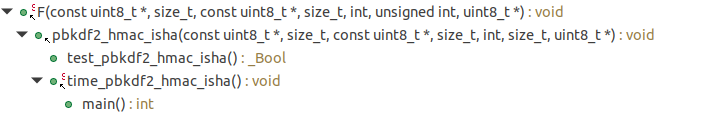
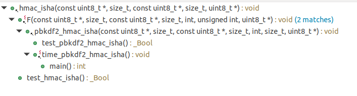
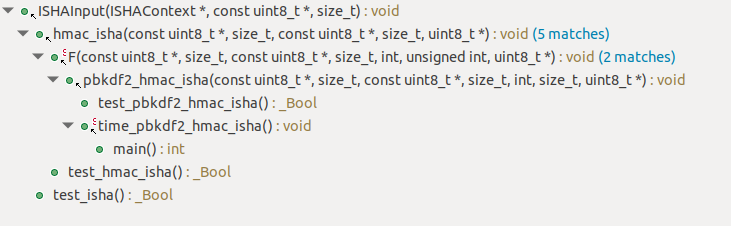
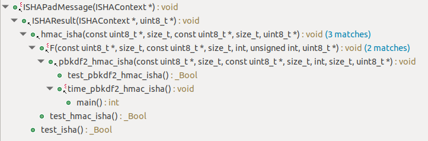
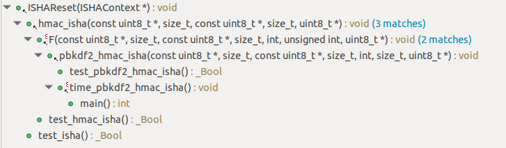
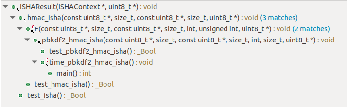
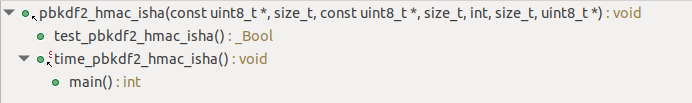

# Optimization of ISHA 

## Introduction 
The goal here is to optimizing for better performance of key derivation function is known as PBKDF2, which is defined in RFC 8018. PBKDF2 is
used in a number of applications, including WPA2-PSK—perhaps the most widespread authentication
system used today in deployed Wi-Fi networks.
As used in WPA2-PSK, the PBKDF2 function relies on calling HMAC-SHA1 8192 times; each call to
HMAC-SHA1 in turn results in two calls to the SHA-1 secure hashing algorithm. And optimizing the digest/hashing described under ISHA - Insecure Hashing Algorithm 

## Basic Flow of Code 
As defined here : https://tools.ietf.org/html/rfc8018   
Modified here for better clarity and updated parts of the documentation    

Params:        ISHA        Implementation of Insecure Hashing Algorithm ( Basically, a Pseudo Random Function Generator)

Input:          P          password, an octet string  
                S          salt, an octet string    
                c          iteration count, a positive integer  
                dkLen      intended length in octets of the derived key, a positive integer, at most (2^32 - 1) * hLen  

Output:         DK         derived key, a dkLen-octet string  

Steps:  

    -  If dkLen > (2^32 - 1) * hLen, output "derived key too long" and stop 

    -  Let l be the number of hLen-8 bit (1 byte) blocks in the derived key, rounding up, and let r be the number of 8 bits in the last block:

        - l = CEIL (dkLen / hLen) 
        - r = dkLen - (l - 1) * hLen

    -  For each block of the derived key apply the function F defined below to the password P, the salt S, the iteration count c, and the block index to compute the block:

        - T_1 = F (P, S, c, 1) , 
        - T_2 = F (P, S, c, 2) ,
        - ...
        - T_l = F (P, S, c, l) , 

        where the function F is defined as the exclusive-or sum of the first c iterates of the underlying pseudorandom function PRF applied to the password P and the concatenation of the salt S and the block index i:

        - F (P, S, c, i) = U_1 \xor U_2 \xor ... \xor U_c

        where
               - U_1 = ISHA (P, S || INT (i)) ,
               - U_2 = ISHA (P, U_1) ,
               - ...
               - U_c = ISHA (P, U_{c-1}) .

        Here, INT (i) is a four-octet encoding of the integer i, most significant octet first.

    -  Concatenate the blocks and extract the first dkLen octets to produce a derived key DK:

        - DK = T_1 || T_2 ||  ...  || T_l<0..r-1>

    -  Output the derived key DK.

**Technically, the following is observed:**
    -  hmac_isha computes the HMAC value for a given key and bytestream, using ISHA as the underlying hash. The output is also a 20-byte value.
    -  pbkdf2_hmac_isha can be used to derive keys of arbitrary length, based on a password and salt specified by the caller.  The output of PBKDF2 is a derived key, DK, of the length in bytes specified by the dk_len parameter.

### Outline of ISHA 
A typical application of the key derivation functions defined here
   might include the following steps:  

    -  Select a salt S and an iteration count itr 

    -  Select a length in octets for the derived key, dkLen. 

    -  Apply the key derivation function to the password, the salt, the iteration count and the key length to produce a derive key.
        - We define two fixed and different strings ipad and opad as follows (the 'i' and 'o' are mnemonics for inner and outer):

            - ipad = the byte 0x36 repeated B times
            - opad = the byte 0x5C repeated B times.

        - Append zeros to the end of authentication key to create a block length byte string (e.g., if authentication key is of length 20 bytes and Block Length=64, then authentication key will be appended with 44 zero bytes 0x00)
        - XOR (bitwise exclusive-OR) the block length byte string computed in previous with ipad
        - Append the stream of data 'text' to the block length byte string resulting from previous step
        - Apply H to the stream generated in step previous step
        - XOR (bitwise exclusive-OR) the block length byte string computed in First Step with opad
        - Append the H result from step (4) to the block length byte string resulting from previous step
        - Apply H to the stream generated in the previous step and return the result

    -  Output the derived key.  

**Technically,**  
- ISHAReset is used to restore an ISHA context to its default state. You can think of this as an initialization function.
-  ISHAInput is used to push bytes into the ISHA hashing algorithm. After a call to ISHAReset, ISHAInput may be called as many times as needed Like SHA-1, the ISHA algorithm can hash up to 2^61 bytes.
- ISHAResult is called once all bytes have been input into the algorithm. This function performs some padding and final computations, and then outputs the ISHA hash—a 160-bit (20 byte) value.

### Profiling Analsysis before Optimization

Profiling Based Time : 
- Following Calculations Exclude the Timings taken by test functions and test_function calls to each function
    - For the base case of the following the Time in Msec run is
        - const char *pass = "Boulder";
        - const char *salt = "Buffaloes";
     
    Without ISHA for 4096 iterations:  
    - **pbkdf2_hmac_isha(...)** which calls the **F()** which in turn calls **hmac_isha()** :  107 msec 
     
    With ISHA :  
    - A generic code flow is as follows (internal loop branching is ignored),   
        - pbkdf2_hmac_isha() -> F() -> hmac_isha() -> ISHAReset()   
        - ..........................-> hmac_isha() -> ISHAInput()   
        - ..........................-> hmac_isha() -> ISHAResult()   

    With Internal Loops a single iteration of hmac_isha() leads to following times  

    For 4096 iterations following is observed  
    Single call to F() takes - 2917 msec  
    Since F() is called 3 times based on the pbkdf2_hmac_isha() it takes a total of 2917 msec * 3 Iterations = **8751 msec**  
    With Function and loop overheads of pbkdf2_hmac_isha() it takes a total of **8776 msec** for the code to run 

    - **Qunatiative Analysis**
        - For the Above Analysis the number of function calls are as follows  (Approximate Results)
            - pbkdf2_hmac_isha(...) = #1 
            - F(...) = #3
            - hmac_isha() = #4096
            - ISHAReset() = #24576
            - ISHAInput() = #49152
            - ISHAResult() = #24576
            - ISHAProcessMessageBlock(...) = 49152
            - ISHAPadMessage(...) = 24576
            
    - **Call Stack Analysis**
            - F(...)
            - 
            - hmac_isha(...)
            - 
            - ISHAInput(...)
            - 
            - ISHAPadMessage(...)
            - 
            - ISHAReset(...)
            - 
            - ISHAResult(...)
            - 
            - pbkdf2_hmac_isha(...)
            - 

**Thus it makes sense to Optimize for speed, the Functions with the maximum number of function calls should be prioratized, ideally it should Time for single function multiplied by the Number of calls but, it takes approximately 1msec to run ISHA Algorithm**  

### Size Analysis 
     Name	                Size   
.text.hmac_isha 	        0x00000186  
.text.F         	        0x000001dc  
.text.pbkdf2_hmac_isha	    0x00000130  
.text.main   	            0x0000004c  
.text.time_pbkdf2_hmac_isha 0x00000154  
.text.run_tests 	        0x0000006a  
.text.ISHAProcessMessageBlock 	0x00000152  
.text.ISHAPadMessage 	    0x0000010e  
.text.ISHAReset	            0x00000060  
.text.ISHAResult	        0x000000c0  
.text.ISHAInput	            0x000000ae  
--------------------------------------- 
Total                       0x00000ACA

### Size Analysis Post Optimization
     Name	                Size   
.text.hmac_isha 	        0x00000154  
.text.F         	        0x000002f4  
.text.pbkdf2_hmac_isha	    0x000000f8  
.text.main   	            0x0000004c  
.text.time_pbkdf2_hmac_isha 0x00000154  
.text.run_tests 	        0x0000006a  
.text.ISHAProcessMessageBlock 	0x00000640  
.text.ISHAPadMessage 	    0x000000dc  
.text.ISHAReset	            0x0000005c  
.text.ISHAResult	        0x0000011e  
.text.ISHAInput	            0x00000094  
---------------------------------------------  
Total                       0x00000A34  
    

# Code FLow UML 
[Link to UML](https://viewer.diagrams.net/?highlight=0000ff&edit=_blank&layers=1&nav=1#R7V1tU9u6Ev41HuDOwDhOSOFjCeWUC7TcwpnTni%2BM4yiJTh0rlW1ezq%2B%2F2tWrHSeEEmK3yUynJLJs75tWu49WitfuTR7%2F4OF0fMUGJPYCf%2FDotU%2B9IOgcH7fEH2h5ki3BsX8sW0acDmRbyzbc0H%2BJavRVa04HJC10zBiLMzotNkYsSUiUFdpCztlDsduQxcW3TsMRmWm4icJ4tvUvOsjGsvUoeGfbPxI6Gus3t7qKv0moOytO0nE4YA9OU%2FuD1%2B5xxjL5afLYIzFIT8tF3nc256ohjJMkW%2BaGx4d3wfm3b5f3F91P%2F%2Fvv38Mfwe14v6X4SLMnzTEZCAGor4xnYzZiSRh%2FsK0nnOXJgMBjffHN9rlkbCoaW6LxH5JlT0qbYZ4x0TTOJrG6Sh5p9lXdDp%2B%2FweeDQ%2FXt9NG5dPqkvyQZf%2FpqO8LXb%2B41ext%2B0%2FfNiklJLmU5j8gi2ShzC%2FmIZIv6tWVHEJzzBqWFPwibEEGQ6MBJHGb0vmhZoTLQkelndSg%2BKDW%2BRKXyufdhnKs3eUE3FgycTAuK7v7IwfROJoI%2Fmnjt9%2BKqP30U%2F6PUfNm%2Bn4FO4VrXuZaRx2w%2FjOlI3RcJ4RJunyk%2BjdRffHNfN2R0Qu6m%2Fe%2BDYXA3noTRHRXDYndP9xMM92fu5eUW0WtabhvP9PopbmMyzOTFI7g4y88sS6Lv5%2F4%2FwveAZmEMVrCCT7wVvKegcSCMJqMYugtPE6NPg%2F%2FG0FKWjvPM5UTxFowP80QwyBIv6AEHyQAI5TTJUkM3J2ku%2FHIyAnef81B2Xy%2BZ9QsKLcSfMZKemBlF%2B1ksZoC5BnJDUJz51NpCmKYPjA%2BMzNNQ3Bv4CSHggAO%2F%2F2QsphF2Iv6GE%2BEwTpJ%2BCn%2BUAYfxiHGajSepa0Bg%2B2mFxYM%2F8B9Ed%2BQ0Imkaov%2Bsnz0xjYTCSxOeHmyoac86vy8ky3mSyhurjPsmj0CHoukspHHOwbDZEGeRNEMzSKVfRKOAGQJn3e8k0Y6R58nBC%2FRfCmjUPHUq2Tth94QPY4zEhhSmVjcyGXA2vdUT%2FsLwQTxFzIIL53t1df9QRYAqBt5%2Fp74%2F2ICy46u2sRtM6o4rjxGCihihJDUxDqfwMWKTKUuQexnV6TD4SDeY%2BLdTKa%2BFQcrSQmzNiCyokJhuWzrSUu%2B7ZmIqczQWdAoa6xQfwIbDVBhIWQmG6KX0MuBfe%2BGfFxcXZ4T8%2BJf8%2FeNyP9qvJxo3kXUhrrZh9sLIuhT1%2FmSoXRFrVwooqDWybnRoffaLhdGzQZITRs8Lkc5ARzBZDMiQJhgChTYEJY9RnKfiAfuMA9n5xEw1eH1IuZxx4ClCqmGGEw%2FEqQ0ILiSN5zcf37sRE3yeTmOKvLppgg0Nr%2B3kOSaNYCViSSSEm6gkwNWBimBvSjT3YxZ9B7UIXwZvo79S4H6e0IyKYPZJRre3LqOLmAwxFkozxlG7NDE9Q85D%2BbT1SgGCI5hmxzSC6Pvj1fvePlgkhuQ48GCy4RidvSQkezuKb8dIlk1Qtez8j2E6JtY5FPRhR08xX9FjrM9lIkszzXIjmBWeQASonIqxJbqcXPYuLj98quBBiwCSKFpI2qUsxkI0isEZnW5aWqMMSIQtGY3yOORmcpDmhFeF4EkiU%2B4ws%2FMNitRxblruUtYgZbylfiY7%2FnHXk8nVJqauZzSx7lnFAiwWPl0OgjGqN22GQ4MQZ%2Fdaknoj%2F0TyD93DR4k3%2BX%2FeteDzYe8RI50%2F7wL368HBQfFq8kK2cF6KYuEkC4wl5AHXSyo07C%2F49zAmnFRRsOimBf8U8yiI6y8lefneux78E7Pyp1u4RPdQbHYuXQkFwRwKBG2rfx3qc4XER3OJ996dRCI5f3e654wFMBFUYGM8RfMQHr8AGHSP%2FFmI593hLGDRbvtvlazWj%2FFsQZ5quRzVuuZq1lm%2FOVcas%2BbaXnbRtdWsRdd2k6GhX3zBdTYrXwIpOp9MYzIhcoXy%2BuTi9CzYN%2Bmsp2Cj%2BqM9i2Nh9v%2FlDObhIx98hJ8SndIeHgQQ0X1imPdlY8xBxjGukAw5m6w%2FoldRtKQXUySQ693p%2BR8fbm4xKfVl1IfXD8iB%2FIQBSP8JcbdNS0JegTDNJPj1c3MLMImwXQsqJPmkjzgJJsQy2pT3g85pJgccWAHiYGopeCfe0RYUhTEk4BkZbGKKiqkaCRF300ChAy0MCBf%2BDqT9ncC85gBeZ44A4wU4cf1M7gA1O24arlC5HfhbuOBCMJEIfjIXxSoDqcgvRLG5cpBk%2FQakiXqJjAf0fikLrOhX0fTitL1nYHojNTM2laRFyMHDyEJeegll8P0SZx8WZbJqBVRgOThbLkudcjbII0TOKkz89EI6v6qnvvhVC%2F6J9%2Bh8%2BFZCCxpCuJV5vv7qGWil0Cc2DhqJEn04LHCrthkjmE2ll9bwTxiHgjdPwwxErIF9CWpGUT6RDtcrrD5IXBP7VC1OnBo9XaCedndOL3b2XsCMfJixtIN1yGHO7OtWr8wPiZeQcpWPRvetR4qKepSnZlOqxIq%2BC0ywRNmzaOSzVDYNJenoom6VcbcqUZKKjN9Ux6w%2Bb%2BvUjpK0XyrH3w4lqaz0qKhMfyMMxMAez2Ag3ouqY56HdH6ufmZ%2BWcwS5TOtddXPVFPp1wl8tbzXbzZoPaP0GlR6VKtGW43R6JsM4jqGqP9KheKt7%2FVCtOowZbJWf56bb3eLU%2FOxmobPluzfPfZLxiQpWOmUULWi0RiMdaPA1Z5MtW1xjYusDhHJkO0j8ZjExMMypZxAQf%2BIbCDG85oas%2Fqpx4Xt86HU5p0En8tZrkSBTy4%2Fq8ok4bYwPpSFVJjqgCm0T7GoTHzcgzTnBKqtnIKr%2BnnVJV%2BFmkyHrd1uZ0%2FldOKPkMUoG6%2FdoAMg4f1gQAEms%2FUtdI6KJG0IcxS1hK8UGemTGagqKxVfpuGghjJE0f4v4QynWgswyx1m9RtH%2FRSg5i9xYOW2GhoE9SBh%2BUdZqob%2BdkCHQ4IBCxACQw1hCClZ2YWpL1hJiYVRzVgd25WK36E7htQdhp8R6pwkZMISGqVm1qFJguNWsSXmKL5XAhHr4USJWw4%2FhbRK5%2BE%2Ftrto3FOikLhux1OlevXTzRbQfdibR%2FcGzu23xSUICIjAAu%2BdaWQgMVivi1EmmPEDrtAQLox3Uj8LH3cBCP%2F6%2BYvxCMCC20pNK3Cwt7eBevaCtgcl%2FrgETxviJrEyVNYoq6lTL8nMVipf6CsRJ3LhB4zyxA5sOUfATaMDJ6KQWD9yDM9Ze0AggyyvWENQWg%2BEiKd9Cn5ILSQmiuEHiullnxg5ocdSm4w7Hc8EHPVrU7PmP%2Fr%2BJo6wXYrmLD3Obp9mDzQt7u76%2FGXPWDZOOmXLVX7YrFulGQFK5TiRSl%2B7VEslHC%2F9jr53M63hdzQHnGA3Up33CCOoOF1l1nIHjoyDGrJjJmvUDL8C%2FyHhG7uKH%2BVcJYURSyCcc6tvlF56%2Bor%2FBXCcOor2Xss2pspyeV6nvAobR9WaPVr6TBsGZ1XYIiq9g64MbC1jEDc0wdqWB7nl7r7gn%2BDlqtoLwzJbJNfTt7gZ%2BiRM6BRrNYyO5uwxmalNUHir5miEsAGzhgCcXUu%2Br2TXEwincMunU4DmxFijgsd8tmTjlSqcUWkbKLsyXJ3SkTxIZFfk%2B8LPm62qMsAF6emqJRXv2TTGbIrEnX6ZNIjnRvy6GX61wLSRnxUMyQmAyx5hko52VWXehD7uGUEVq4F%2BLyFp6GigzOllvP3Ws7VBKCSiZuYHB%2BFgrrMqi7K8%2FVh74JpK16ec3FOGwKmElDcwDkMfGvj7KlR2IuTvNs%2FnWBxnB%2FwSQ2NDxPfrULD6IsCZSrWKgoi5xWt6v2OpzuDZjZLdzgpKACurCqp2bq2yAvAZcb3kmKONKgAM6tkmWX%2Fl19GSlUJSFXWVfh01uRgHwpPzRMxom1CM8z6KyDSTYLgTXGHqZmByW6qTyIR%2BKgbHzOFMPE8ShMzWHpMpwAEyFTde%2FE7IFEnnYXlDlM1WzMqA3KNA%2BCQ1%2FMttZ3hBh7BrX7y4RPruLqG8R%2FGlmj4Kd115tEMzY4m1W%2F8a9kY6uVxrz2pGKosmETebiHGwEDGdw%2Bhy9jQW2kNVjqMN0IIvdgPN0jmyf3VyKUGXwr6dAoaEw%2F3ZvSJvtq0G4TUNdHU7%2FznydLHAYQv3LGPBGEKpKcOTXVPVmSZpFsqPjpDkuiXgVDFD7F7WdZgDq3qv41QCge7heuo0wSgOuT1OMGKc51O5EVXXkiRQX1VxeFDpBC3PxdaWpEq5ZI1SFfQL761PvZgmLgIIi%2FtOFefYiHjhYue2KrIbluN0S%2Fucjv3ZJOewVRWyH71VknPcwCRnzs6FzUpy3nCX089tePHq2iChB8Tzec%2Bc7Hg9eY8ms7mJzxfENDch89me8fK2Sdn2jJdfJ495s5rW7RkvK6Nge8bL9oyXn0yGtsd4LHSw22M81pfdls46PdQ%2Fb%2FPcKR5vl91W%2FjBH3entvI3cG5XfVp5C27RsiWyTJW%2BbLG2TpfVTsE2WtsnSPAq2ydI2WZp74zZZWu7WbbLUrGSppQP6GpOlJhY8zjuYbrOSpcO5ydKQqeM7yk4aLuynuBQIrrjTqvLFMtp3hox83Jwx4wyJFYyA0lr4flCxGF6pze6bDYDuG4lZJlL1CPm4JOaKuur1Sjk4nuG5ob9y4q1uDVu70obX7moym4vKXIcDVWq0CdCMjKRsFdwkxzqwvtoEOrApTKhqDREDgUkT88iDioT4tnBcOzylhsLePm6pdNmBgHyntTOf4jh0auBkjszJFI6RS%2Bwp9Kbi1%2BaD62WMcTqC3xS0aqvi6L08dMSpQe6T7IGg9tIxy%2BOBFgvkA%2F7MT5mulyd1Rop74po1SZE3iZxZVjyqZJqlsmQ8xhC%2Fjzm4eITqg%2Fdfnai8tP5M2%2Fw0p2ZEllWey23ByHkYp5g2h%2FhtQdXjmim3P%2Foqaf7L2a7MVS4nYUXczR8mZrClaS7PU1AIaVmr9atFbylU%2B677cnDo7YgbCHs1ohK%2BNyY4bHGkpwThp6qdF9aSDABlC7jTiRxI%2BJAxi61bofL3sivnpWdxFOVOJe5lT94s84515zCezXEKFf5NUQ1d1MkPahQZZG15utQhAnCYBk1y4jKnEY8QpSl6GMhuLTDQvhGPpvUcQjHhGdQPSavzcNQ60QqqvVfGzQ1AcRWOywQAzsYmFTkAuK5%2FleYVUmwYkNQKOsUMr1OBJK25qDxoIpI0rzp4o5Ak%2FaYGJ3jPRFa%2Faaan2HZOTld7f2wy5xVWuazLq1qV0PF1DaH0gSWaRGGeFsL92W1q8486UhNIee9YEyKx%2BiloQCz4EQ4PshHXlTk%2FyNqwsgOlajRUk%2FGWQ8ZXxDELjnwCayys87W6vmfAkYL1te1AwyhP5YUI7qouh68g8veJMI7aS0YYrTc7myOoWhGpPcKYg93%2BJhGG%2BMoZuCHbnYfT8ZVwOtDj%2Fw%3D%3D)

# Code Optimization 
Following Changes were incorporated .  

## Function -> static void ISHAProcessMessageBlock(ISHAContext *ctx):**  
1) W(t) loop was combined into a single loop  
    -  Previously  
        for(t = 0; t < 16; t++)  
        {   
            W[t] = ((uint32_t) ctx->MBlock[t * 4]) << 24;  
            W[t] |= ((uint32_t) ctx->MBlock[t * 4 + 1]) << 16;  
            W[t] |= ((uint32_t) ctx->MBlock[t * 4 + 2]) << 8;  
            W[t] |= ((uint32_t) ctx->MBlock[t * 4 + 3]);  
        } 

        for(t = 0; t < 16; t++)  
        {  
            temp = ISHACircularShift(5,A) + ((B & C) | ((~B) & D)) + E + W[t];  
            temp &= 0xFFFFFFFF;  
            E = D;  
            D = C;  
            C = ISHACircularShift(30,B);  
            B = A;  
            A = temp;  
        } 
 
    - Updated  
        while(t<16) { 
        temp = (ISHACircularShift(5,A) + ((B & C) | ((~B) & D)) + E +  
                ( (((uint32_t) ctx->MBlock[t*4]) << 24) | (((uint32_t) ctx->MBlock[t*4+1]) << 16) |
                        (((uint32_t) ctx->MBlock[t*4+2]) << 8) | ( ((uint32_t) ctx->MBlock[t*4+3]))) ) & 0xFFFFFFFF ;  
        E = D;   
        D = C;  
        C = ISHACircularShift(30,B);  
        B = A;  
        A = temp;  
        t++;  
        }  
 

## Function -> static void ISHAPadMessage(ISHAContext *ctx):**  
1) Padding logic was changed to incorporate processing data from a single length file  
2) memset replaced setting to '0' logic 
3) Padding of length had to be recalculated in terms of bytes and bits 
    -  Previously  
        if (ctx->MB_Idx > 55)
            {
                ctx->MBlock[ctx->MB_Idx++] = 0x80;
                while(ctx->MB_Idx < 64)
                {
                ctx->MBlock[ctx->MB_Idx++] = 0;
                }
                ISHAProcessMessageBlock(ctx);
                while(ctx->MB_Idx < 56)
                {
                ctx->MBlock[ctx->MB_Idx++] = 0;
                }
            }
            else
            { 
                ctx->MBlock[ctx->MB_Idx++] = 0x80;
                while(ctx->MB_Idx < 56)
                {
                ctx->MBlock[ctx->MB_Idx++] = 0;
                }
            }

            ctx->MBlock[56] = (ctx->Length_High >> 24) & 0xFF;
            ctx->MBlock[57] = (ctx->Length_High >> 16) & 0xFF;
            ctx->MBlock[58] = (ctx->Length_High >> 8) & 0xFF;
            ctx->MBlock[59] = (ctx->Length_High) & 0xFF;
            ctx->MBlock[60] = (ctx->Length_Low >> 24) & 0xFF;
            ctx->MBlock[61] = (ctx->Length_Low >> 16) & 0xFF;
            ctx->MBlock[62] = (ctx->Length_Low >> 8) & 0xFF;
            ctx->MBlock[63] = (ctx->Length_Low) & 0xFF;

 
    - Updated   
         
         if (ctx->MB_Idx > 55) 
            {   
                 ctx->MBlock[ctx->MB_Idx++] = 0x80;
                 memset(ctx->MBlock + ctx->MB_Idx, 0, ISHA_BLOCKLEN - ctx->MB_Idx);
                 ISHAProcessMessageBlock(ctx);
                 memset(ctx->MBlock, 0, ISHA_BLOCKLEN - 6);      
             }
             else
             {
                 ctx->MBlock[ctx->MB_Idx++] = 0x80;
                 // Had to remove the while loop here
                 memset(ctx->MBlock + ctx->MB_Idx, 0, 59 - ctx->MB_Idx);
             }
<strong>
        ctx->MBlock[59] = (ctx->buffer >> MBlockConst1) & 0xFF;  
        ctx->MBlock[60] = (ctx->buffer >> MBlockConst2) & 0xFF;  
        ctx->MBlock[61] = (ctx->buffer >> MBlockConst3) & 0xFF;  
        ctx->MBlock[62] = (ctx->buffer >> MBlockConst4) & 0xFF;  
        ctx->MBlock[63] = (ctx->buffer << MBlockConst5) & 0xFF;  
</strong>
 

## Function -> void ISHAResult(ISHAContext *ctx, uint8_t *digest_out)**  
1) All the big endian calculations were replaced with bswap32  
    -  Previously  
        for (int i=0; i<20; i+=4) {  
        digest_out[i]   = (ctx->MD[i/4] & 0xff000000) >> 24;  
        digest_out[i+1] = (ctx->MD[i/4] & 0x00ff0000) >> 16;  
        digest_out[i+2] = (ctx->MD[i/4] & 0x0000ff00) >> 8;  
        digest_out[i+3] = (ctx->MD[i/4] & 0x000000ff);  
        }  
 
    - Updated  
        *((uint32_t *)(digest_out )) = bswap32(ctx->MD[0]);  
        *((uint32_t *)(digest_out + 4)) = bswap32(ctx->MD[1]);  
        *((uint32_t *)(digest_out + 8)) = bswap32(ctx->MD[2]);  
        *((uint32_t *)(digest_out + 12)) = bswap32(ctx->MD[3]);  
        *((uint32_t *)(digest_out + 16)) = bswap32(ctx->MD[4]);  
 

## Function -> void ISHAInput(ISHAContext *ctx, const uint8_t *message_array, size_t length)**  
1) Length_Low and Length_High were replaced by a single buffer calculation and Corrupted check was removed 
    -  Previously  
        if (ctx->Computed || ctx->Corrupted)  
        {  
            ctx->Corrupted = 1;  
            return;   
        }  

        while(length-- && !ctx->Corrupted) 
            {
            ctx->MBlock[ctx->MB_Idx++] = (*message_array & 0xFF); 

            ctx->Length_Low += 8;
            ctx->Length_Low &= 0xFFFFFFFF;
            if (ctx->Length_Low == 0)
            {
            ctx->Length_High++;
            ctx->Length_High &= 0xFFFFFFFF;
            if (ctx->Length_High == 0)
            {
                ctx->Corrupted = 1;
            }
        }
 
    - Updated  

        ctx->buffer += length;
        while(length)
        {
        temp = length;
        if( (ISHA_BLOCKLEN - ctx->MB_Idx) < length) {
            temp = ISHA_BLOCKLEN - ctx->MB_Idx;
        }

        memcpy(ctx->MBlock + ctx->MB_Idx, message_array, temp);
        ctx->MB_Idx += temp;
        message_array += temp;
        length -= temp;
        

## Function -> void F(...)**  
1) Part of the logic of the hmac_isha into F(__) to remove duplicate checks and assertions 
    -  Previously  
        for (i=0; i<salt_len; i++)
        saltplus[i] = salt[i];
 
        **AND**  
 

        for (int j=1; j<iter; j++) {  
        hmac_isha(pass, pass_len, temp, ISHA_DIGESTLEN, temp);
        for (int i=0; i<ISHA_DIGESTLEN; i++)
        result[i] ^= temp[i];
        } 

 
    - Updated  
        - Following Sections were copied from hmac isha and added here    
        uint8_t inner_digest[ISHA_DIGESTLEN];   
        ISHAContext ctx;   
        uint8_t ipad[ISHA_BLOCKLEN];   
        uint8_t opad[ISHA_BLOCKLEN];   
        for (i=0; i<pass_len; i++) { 
            ipad[i] = pass[i] ^ 0x36; 
            opad[i] = pass[i] ^ 0x5c;
        }

  

        for (int j=1; j<iter; j++) { 
            hmac_isha(pass, pass_len, temp, ISHA_DIGESTLEN, temp);
            for (int i=0; i<ISHA_DIGESTLEN; i++)
            result[i] ^= temp[i];
        }

 
        memset( ipad + i, 0x36, ISHA_BLOCKLEN - i );    
        memset( opad + i, 0x5C, ISHA_BLOCKLEN - i );  
        memcpy( saltplus, salt, salt_len );   
        i = salt_len;  
        // Perform inner ISHA  
        ISHAReset(&ctx);  
        ISHAInput(&ctx, ipad, ISHA_BLOCKLEN);   
        ISHAInput(&ctx, saltplus, salt_len+4);  
        ISHAResult(&ctx, inner_digest);  
        // perform outer ISHA  
        ISHAReset(&ctx);  
        ISHAInput(&ctx, opad, ISHA_BLOCKLEN);  
        ISHAInput(&ctx, inner_digest, ISHA_DIGESTLEN);  
        ISHAResult(&ctx, temp);  
        memcpy( result, temp, ISHA_DIGESTLEN );  
        int j = 1;
        while(j<iter) {
            # Perform inner ISHA
            ISHAReset(&ctx);
            ISHAInput(&ctx, ipad, ISHA_BLOCKLEN);
            ISHAInput(&ctx, temp, ISHA_DIGESTLEN);
            ISHAResult(&ctx, inner_digest);
            # perform outer ISHA
            ISHAReset(&ctx);
            ISHAInput(&ctx, opad, ISHA_BLOCKLEN);
            ISHAInput(&ctx, inner_digest, ISHA_DIGESTLEN);
            ISHAResult(&ctx, temp);
            int i = 0;

 
            while(i<ISHA_DIGESTLEN) {
                result[i] ^= temp[i];
                i++;
            }
            j++;
        }
        
  
